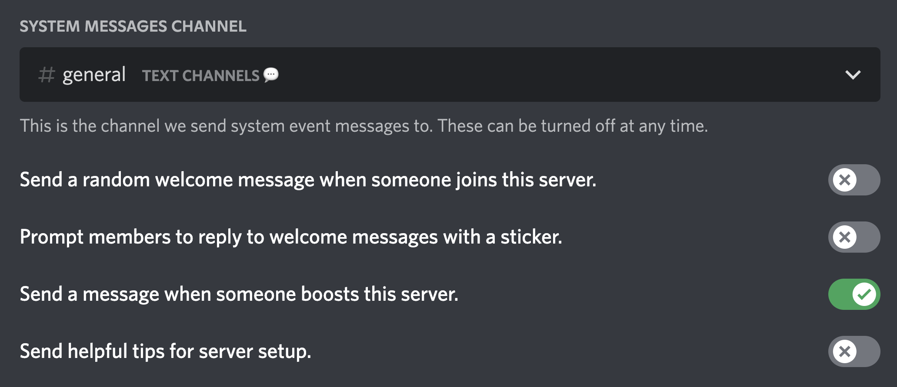

Let's set up a few things so that the bot can detect new boosters properly.

!!! caution "Detecting members who boosted before the bot was added:"

    By default, the bot adds existing boosters to the booster database with `1x boost`, but there is NO WAY for the bot (or anyone else) to see how many times someone has boosted.
    However, you can edit anyone's number of boosts with [Booster Bot Premium](https://boosterbot.xyz/premium).

1. Enable Discord's system boost message to detect boosts.
2. Give the bot read message permission in the system channel to see system messages.
3. Send message & embed links permissions in `greet-channel` and `log-channel` (optional).

Server settings screenshot:

However, there are a few things to note here -

!!! info

    `1.` There are cases when someone boosts 2 times rapidly (1 by 1), and if the bot had any occasional lag at the same time, the bot will count that as 1 boost instead of 2.

    `2.` If you've not set up the bot correctly OR the bot had any downtime, you can add missed boosters with the `bb boosters add @user` command, and the booster will be added with `1x boost`.

---

Now that you've set up the new boost detection, let's continue with the boost removal part.

-   The bot will detect that someone removed a boost only if Discord's default booster role is removed from them. This means that it'll only detect when a booster removes all of their active boosts from the server.
-   Example: If someone had 2 boosts and they removed 1, no one (including the bot) can detect that they removed the boost. It is something that Discord lacks.

---

With all the information you have on how the bot works, let's begin with greeting & logging.

**Greet Message:**

The thank-you message for boosts can be set up with the `bb greet` command. You can check more about that command [here](/commands/greet) OR type `bb help greet`, and the bot will show you all available options to customize the message.

**Log Message:**

Updates on boosts added/removed can be set up with the `bb setup log-channel` OR `bb setup log-events` command. As the bot has many things to offer to boosters, it can log everything you need with the `log-channel` command in one channel. If you need a separate channel for separate events OR you only want specific events like boost-added logs, you can use `log-events` for that.
